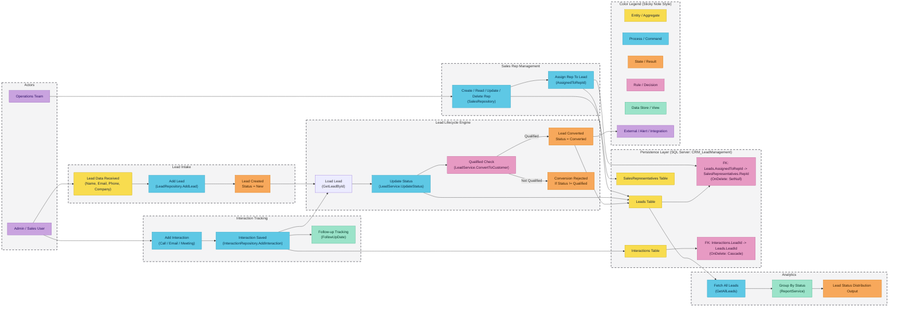

# Lead Management System - Final Colored Diagram

```mermaid
flowchart LR

%% =========================
%% Nodes
%% =========================
subgraph actors["Actors"]
    U1["Admin / Sales User"]
    U2["Operations Team"]
end

subgraph intake["Lead Intake"]
    I1["Lead Data Received<br/>(Name, Email, Phone, Company)"]
    I2["Add Lead<br/>(LeadRepository.AddLead)"]
    I3["Lead Created<br/>Status = New"]
end

subgraph lifecycle["Lead Lifecycle Engine"]
    L1["Load Lead<br/>(GetLeadById)"]
    L2["Update Status<br/>(LeadService.UpdateStatus)"]
    L3["Qualified Check<br/>(LeadService.ConvertToCustomer)"]
    L4["Lead Converted<br/>Status = Converted"]
    L5["Conversion Rejected<br/>If Status != Qualified"]
end

subgraph reps["Sales Rep Management"]
    R1["Create / Read / Update / Delete Rep<br/>(SalesRepository)"]
    R2["Assign Rep To Lead<br/>(AssignedToRepId)"]
end

subgraph interactions["Interaction Tracking"]
    T1["Add Interaction<br/>(Call / Email / Meeting)"]
    T2["Interaction Saved<br/>(InteractionRepository.AddInteraction)"]
    T3["Follow-up Tracking<br/>(FollowUpDate)"]
end

subgraph reporting["Analytics"]
    A1["Fetch All Leads<br/>(GetAllLeads)"]
    A2["Group By Status<br/>(ReportService)"]
    A3["Lead Status Distribution Output"]
end

subgraph persistence["Persistence Layer (SQL Server: CRM_LeadManagement)"]
    D1["Leads Table"]
    D2["SalesRepresentatives Table"]
    D3["Interactions Table"]
    D4["FK: Leads.AssignedToRepId -> SalesRepresentatives.RepId<br/>(OnDelete: SetNull)"]
    D5["FK: Interactions.LeadId -> Leads.LeadId<br/>(OnDelete: Cascade)"]
end

subgraph legend["Color Legend (Sticky Note Style)"]
    G1["Entity / Aggregate"]
    G2["Process / Command"]
    G3["State / Result"]
    G4["Rule / Decision"]
    G5["Data Store / View"]
    G6["External / Alert / Integration"]
end

%% =========================
%% Flow
%% =========================
U1 --> I1 --> I2 --> I3
U2 --> R1 --> R2 --> D1

I3 --> L1 --> L2 --> D1
L2 --> L3
L3 -->|Qualified| L4 --> D1
L3 -->|Not Qualified| L5

U1 --> T1 --> T2 --> D3
T2 --> T3
T2 --> L1
R1 --> D2
R2 --> D4

A1 --> A2 --> A3
D1 --> A1

D1 --> D4
D3 --> D5
L4 --> G6

%% =========================
%% Classes
%% =========================
class U1,U2,G6 purple;
class I1,D1,D2,D3,G1 yellow;
class I2,L2,T1,T2,R1,R2,A1,G2 blue;
class I3,L4,L5,A3,G3 orange;
class L3,D4,D5,G4 pink;
class T3,A2,G5 green;

classDef yellow fill:#f8dc4f,stroke:#caa803,color:#1f2937,stroke-width:1px;
classDef blue fill:#5ec8e5,stroke:#2f9fbe,color:#082f49,stroke-width:1px;
classDef orange fill:#f7a85b,stroke:#d97706,color:#3f2200,stroke-width:1px;
classDef pink fill:#e79ac3,stroke:#be5e98,color:#3f1239,stroke-width:1px;
classDef green fill:#9be3c9,stroke:#40b388,color:#073b2b,stroke-width:1px;
classDef purple fill:#c9a3df,stroke:#925ab8,color:#2e1065,stroke-width:1px;

%% =========================
%% Subgraph styling
%% =========================
style actors fill:#f4f4f5,stroke:#52525b,stroke-width:2px,stroke-dasharray: 8 6
style intake fill:#f4f4f5,stroke:#52525b,stroke-width:2px,stroke-dasharray: 8 6
style lifecycle fill:#f4f4f5,stroke:#52525b,stroke-width:2px,stroke-dasharray: 8 6
style reps fill:#f4f4f5,stroke:#52525b,stroke-width:2px,stroke-dasharray: 8 6
style interactions fill:#f4f4f5,stroke:#52525b,stroke-width:2px,stroke-dasharray: 8 6
style reporting fill:#f4f4f5,stroke:#52525b,stroke-width:2px,stroke-dasharray: 8 6
style persistence fill:#f4f4f5,stroke:#52525b,stroke-width:2px,stroke-dasharray: 8 6
style legend fill:#f4f4f5,stroke:#52525b,stroke-width:2px,stroke-dasharray: 8 6
```
